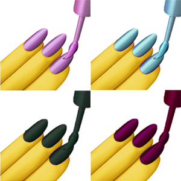

[](https://github.com/erikras/styled-components-theme)

# styled-components-theme
---
[](https://www.npmjs.com/package/styled-components-theme)
[](https://www.npmjs.com/package/styled-components-theme)
[](https://travis-ci.org/erikras/styled-components-theme)
[](https://codecov.io/github/erikras/styled-components-theme?branch=master)
[](https://github.com/prettier/prettier)

[`styled-components-theme`](https://github.com/erikras/styled-components-theme) generates 
selectors for colors in your
[`styled-components`](https://github.com/styled-components/styled-components) theme that allows
color manipulation, using the [`color`](https://github.com/qix-/color) library via calls on the
selectors themselves.

A **selector**, in this context, is defined as a function that looks like
`(props) => props.theme.myColor` that the `styled-components` library [accepts as a template
variable](https://github.com/styled-components/styled-components/blob/master/docs/theming.md#using-theming).

---

## Why?

`styled-components` is an awesome library, and their React context-based theming scheme is great, 
but:

1. Having `${(props) => props.theme.highlight}` functions all over your template literals to use 
   any of your theme colors is both hard to read and cumbersome to type.

2. In migrating from SASS and CSS Modules, I missed the ability to `lighten()` or `darken()` or 
   `transparentize()` a theme color at will to make subtle gradients or overlays.

---

## Installation

Using [npm](https://www.npmjs.org/):

```bash
  $ npm install --save styled-components-theme
```

Using [yarn](https://yarnpkg.com/):

```bash
  $ yarn add styled-components-theme
```

---

## Usage

#### 1) Define your theme colors

```jsx
// colors.js

const colors = {
  main:  '#393276',
  dark:  '#0D083B',
  light: '#837EB1'
}

export default colors
```

#### 2) Apply your theme with [`ThemeProvider`](https://github.com/styled-components/styled-components/blob/master/docs/theming.md)

```jsx
import { ThemeProvider } from 'styled-components';
import colors from './colors' // from Step #1

const App = props =>
  <ThemeProvider theme={colors}>
    {props.children}
  </ThemeProvider>

```

#### 3) Create an importable theme object using `styled-components-theme`

```jsx
// theme.js

import createTheme from 'styled-components-theme';
import colors from './colors' // from Step #1

const theme = createTheme(...Object.keys(colors))
export default theme
```

#### 4) Use the theme colors in your components

```jsx
import styled from 'styled-components'
import theme from './theme' // from Step #3

const Header = styled.div`
  background: ${theme.dark};
  color: ${theme.light};
`

const Button = styled.button`
  background-image: linear-gradient(${theme.light}, ${theme.light.darken(0.3));
  color: ${theme.dark};
  padding: 10px;
`
```

---

## Available manipulation functions

This library uses [the color manipulation provided by the
`color` library](https://github.com/qix-/color#manipulation).

```js
theme.color.negate()         // rgb(0, 100, 255) -> rgb(255, 155, 0)

theme.color.lighten(0.5)     // hsl(100, 50%, 50%) -> hsl(100, 50%, 75%)
theme.color.darken(0.5)      // hsl(100, 50%, 50%) -> hsl(100, 50%, 25%)

theme.color.saturate(0.5)    // hsl(100, 50%, 50%) -> hsl(100, 75%, 50%)
theme.color.desaturate(0.5)  // hsl(100, 50%, 50%) -> hsl(100, 25%, 50%)
theme.color.greyscale()      // #5CBF54 -> #969696

theme.color.whiten(0.5)      // hwb(100, 50%, 50%) -> hwb(100, 75%, 50%)
theme.color.blacken(0.5)     // hwb(100, 50%, 50%) -> hwb(100, 50%, 75%)

theme.color.fade(0.5)        // rgba(10, 10, 10, 0.8) -> rgba(10, 10, 10, 0.4)
theme.color.opaquer(0.5)     // rgba(10, 10, 10, 0.8) -> rgba(10, 10, 10, 1.0)

theme.color.rotate(180)      // hsl(60, 20%, 20%) -> hsl(240, 20%, 20%)
theme.color.rotate(-90)      // hsl(60, 20%, 20%) -> hsl(330, 20%, 20%)
```

---

## FAQ

### Why use `color`? Why not [other color manipulation library]?

Because `color`'s manipulation methods were so influenced by SASS, LESS and
Stylus, they are already familiar to CSS coders.

### Isn't `Color` mutable? Don't I need to `clone()`?

Yes, `Color` is mutable, but this library handles the cloning for you, so
you can chain the manipulation methods together to your heart's content
without mutating the original theme color. e.g.
`theme.primary.saturate(0.3).lighten(0.2).fade(0.4)`.

**The manipulation methods in `styled-components-theme` are *immutable***.

---

Made with ❤️ in 🇪🇸 by [@erikras](https://twitter.com/erikras).
